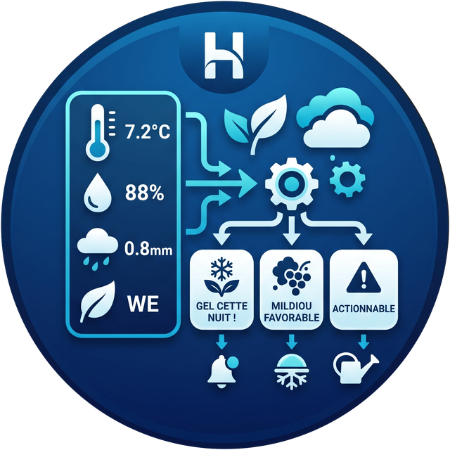

<p align="center">
  
</p>

<h1 align="center">Sentinelle Ecowitt</h1>

Intégration Home Assistant, installable via **HACS**, qui prédit les
risques de **gel** et de **maladies des plantes** (mildiou, oïdium...)
à partir des capteurs de votre station Ecowitt déjà intégrée à Home
Assistant, combinés aux prévisions météo.

[](https://buymeacoffee.com/sdavid66)


## Pourquoi

Une station Ecowitt donne des mesures brutes (température, humidité,
pluie, humectation foliaire...). Ce plugin les transforme en **alertes
actionnables** : "gel probable cette nuit", "conditions favorables au
mildiou depuis 2 jours", etc., directement utilisables dans vos
automatisations (notification, mise en route d'un voile d'hivernage,
arrosage préventif...).

## Fonctionnement

Le plugin **ne communique pas directement** avec votre passerelle
Ecowitt : il réutilise les entités déjà créées par l'intégration
Ecowitt native de Home Assistant (ou toute autre source compatible),
ce qui le rend plus simple, plus robuste, et indépendant du modèle de
passerelle (GW1000, GW2000, WS90...).

Il combine :
- vos capteurs Ecowitt (température, humidité, vent, humectation
  foliaire si disponible) ;
- en secours, les capteurs temps réel d'une station officielle comme
  **MeteoSwiss** (voir ci-dessous) ;
- les prévisions d'une entité météo Home Assistant (`weather.*`) pour
  anticiper sur plusieurs heures/jours ;
- des modèles agronomiques simplifiés pour calculer un niveau de
  risque : `none` / `watch` / `warning` / `severe`.

## Support MeteoSwiss

Si vous utilisez l'intégration [MeteoSwiss](https://github.com/Rudd-O/homeassistant-meteoswiss)
(installable via HACS), vous pouvez l'associer à Sentinelle Ecowitt de
deux manières complémentaires :

1. **Comme source de prévisions** — choisissez simplement son entité
   `weather.*` à l'étape de configuration. C'est elle qui alimente le
   modèle de gel avec les prévisions horaires officielles suisses.
2. **Comme source de secours** — à la deuxième étape du config flow,
   vous pouvez désigner les capteurs temps réel de votre station
   MeteoSwiss (température, humidité, vent, pluie).

Le principe de secours est simple : **votre station Ecowitt reste
toujours prioritaire**. Le capteur MeteoSwiss prend automatiquement le
relais dans deux cas :

- la mesure n'existe pas chez vous (par exemple si vous n'avez pas
  d'anémomètre) ;
- votre capteur Ecowitt tombe en panne, passe en `unavailable` ou
  renvoie une valeur illisible.

Les prédictions continuent donc de fonctionner même si votre station
personnelle est hors service. Une entité **Source des données**
(`ecowitt` / `meteoswiss` / `mixed` / `unavailable`) indique à tout
moment quelle station alimente réellement les calculs, avec le détail
mesure par mesure en attributs — pratique pour recevoir une
notification quand votre Ecowitt décroche.

Cette étape est entièrement facultative : si vous laissez les champs
vides, l'intégration fonctionne comme avant, uniquement avec votre
station Ecowitt. Et rien n'est spécifique à la Suisse — n'importe
quelle autre source de capteurs Home Assistant peut servir de secours.

## Prérequis

- Home Assistant 2024.6.0 ou supérieur.
- Une station Ecowitt déjà intégrée (intégration native `Ecowitt` ou
  équivalent) avec au minimum un capteur de température et d'humidité.
- Une entité météo (`weather.*`) configurée pour les prévisions —
  l'intégration MeteoSwiss convient parfaitement en Suisse.
- (Optionnel mais recommandé pour le mildiou) un capteur d'humectation
  foliaire (ex. Ecowitt WH55).
- (Optionnel) l'intégration MeteoSwiss, pour servir de source de
  secours si un capteur Ecowitt tombe en panne.
- Le **recorder** actif sur vos capteurs de température et d'humidité :
  les modèles maladie ont besoin d'environ 4 jours d'historique horaire.
  Si vous excluez ces entités du recorder, seul le modèle de gel
  fonctionnera.

## Installation via HACS

1. HACS → Intégrations → menu (⋮) → **Dépôts personnalisés**.
2. Ajouter l'URL de ce dépôt, catégorie **Intégration**.
3. Rechercher "Sentinelle Ecowitt" et installer.
4. Redémarrer Home Assistant.
5. Paramètres → Appareils et services → Ajouter une intégration →
   "Sentinelle Ecowitt".

## Configuration

La configuration se fait en trois étapes.

**Étape 1 — votre station Ecowitt :**
- le capteur de température et d'humidité de votre station ;
- (optionnel) vent, intensité de pluie (mm/h), humectation foliaire ;
- l'entité météo à utiliser pour les prévisions (ex. MeteoSwiss) ;
- les modèles de risque à activer.

**Étape 2 — culture surveillée :**
- la culture (détermine les seuils de gel T10/T90) et son stade actuel ;
- la prise en compte de l'effet inhibiteur de la pluie sur l'oïdium.

**Étape 3 — sources de secours (facultatif) :**
- les capteurs temps réel MeteoSwiss (température, humidité, vent,
  pluie) qui prendront le relais en cas de panne.

Ces réglages sont modifiables à tout moment via **Options** sur
l'intégration.

## Modèles de risque

Tous les modèles travaillent sur des **séries horaires** reconstruites
depuis l'historique de Home Assistant, comme l'exigent les critères
publiés (« 6 heures continues », « 11 heures à HR ≥ 90 % »).

### Gel — seuils phénologiques

Il n'existe pas *un* seuil de gel. Un pommier supporte −18 °C en
dormance et souffre dès −2,2 °C en pleine floraison. L'intégration
utilise les tables **T10 / T90** de Washington State University
(températures provoquant 10 % et 90 % de mortalité des bourgeons après
30 min d'exposition), pour pommier, poirier, abricotier, prunier,
pêcher/nectarinier et cerisier doux.

Vous choisissez la culture à la configuration ; le **stade
phénologique** se change ensuite à tout moment depuis l'entité
`select.…_stade_phenologique` — utile pour l'automatiser ou l'ajuster
en observant le verger.

L'intégration estime aussi la **température de surface** : sous ciel
dégagé et vent faible, le rayonnement nocturne refroidit le sol de 3 à
5 °C sous la température de l'air. Une gelée blanche survient donc
couramment alors que l'abri affiche encore +2 °C. Les cultures basses
(tomate, pomme de terre, légumes) sont évaluées sur cette température
de surface, les arbres sur celle de l'air.

### Mildiou — critères de Hutton *et* Smith Period

Deux critères sont calculés en parallèle :

| Critère | Condition | Origine |
|---|---|---|
| **Hutton** | 2 jours consécutifs, T min ≥ 10 °C, **≥ 6 h** continues à HR ≥ 90 % | James Hutton Institute / AHDB, 2017 |
| **Smith** | 2 jours consécutifs, T min ≥ 10 °C, **≥ 11 h** continues à HR ≥ 90 % | Smith, 1956 |

Le niveau de risque suit **Hutton**, plus sensible. Les essais en
enceinte climatique ayant conduit à ces critères ont montré que les
isolats contemporains de *Phytophthora infestans* infectent dans des
conditions nettement moins humides que ne le prévoyait Smith : cette
dernière sous-détecte les génotypes agressifs modernes. Elle reste
exposée en attribut, pour comparaison.

Un capteur d'humectation foliaire, si vous en avez un, remplace le
proxy HR ≥ 90 %.

### Oïdium — indice Gubler-Thomas

Indice cumulatif 0-100 développé à UC Davis, qui pilote l'espacement
des traitements. L'épidémie démarre après 3 journées consécutives
comptant ≥ 6 h continues entre 21,1 et 29,4 °C ; ensuite l'indice gagne
20 points par journée favorable, en perd 10 par journée défavorable ou
par pic à ≥ 35 °C (léthal pour les conidies).

Bandes publiées : 0-30 faible, 40-60 modéré, > 60 élevé — avec un
intervalle de traitement conseillé exposé en attribut.

**Correction ajoutée par ce plugin :** contrairement au mildiou,
l'oïdium est *inhibé* par l'eau libre — la pluie lessive les conidies.
Le Gubler-Thomas d'origine ne modélise pas la pluie ; on applique donc
une pénalité de −10 points au-delà de 2,5 mm journaliers, en reprenant
la règle du modèle « Hop Powdery Mildew » (variante Cascade), lui-même
dérivé de Gubler-Thomas. Désactivable dans les options.

### Suivi des traitements — « protégé jusqu'à »

Un modèle dit « le risque est élevé ». Un outil de décision dit
« traitez avant jeudi ». Le service `sentinelle_ecowitt.log_treatment`
enregistre une application :

```yaml
action: sentinelle_ecowitt.log_treatment
data:
  target: late_blight
  product: Bouillie bordelaise
  residual_days: 10
  rainfast_mm: 20
```

L'intégration en déduit une entité **Protection mildiou / oïdium**
donnant la date de fin de protection, en tenant compte de la rémanence
**et du lessivage** : au-delà du cumul de pluie déclaré, la protection
est considérée comme perdue même si la rémanence n'est pas écoulée.
Tant qu'une protection est active, le niveau de risque affiché est
rétrogradé d'un cran.

Aucune base de produits n'est embarquée : renseignez rémanence et
résistance au lavage d'après l'étiquette de ce que vous appliquez.

### Limites assumées

Ces modèles reproduisent fidèlement des critères publiés, mais restent
en deçà d'un outil professionnel sur trois points :

- **l'inoculum n'est pas modélisé** — trois jours humides en avril sans
  foyer à proximité sont inoffensifs ; les mêmes après une déclaration
  chez le voisin sont critiques. Sans réseau de surveillance régional,
  ces modèles supposent le pathogène présent et alertent donc parfois
  pour rien ;
- **pas de suivi de cohortes d'infection** (latence, sortie des
  lésions) ;
- **aucune validation au champ** — les modèles experts sont calibrés
  sur des essais multi-années et multi-régions.

À utiliser comme aide à la vigilance, pas comme avis phytosanitaire.

### Sources

- Critères de Hutton — [AHDB / James Hutton Institute](https://potatoes.ahdb.org.uk/development-and-implementation-of-a-new-national-warning-system-for-potato-late-blight-in-great-britain-hutton-criteria)
- Indice Gubler-Thomas — [UC IPM, Gubler *et al.* 1999](https://uspest.org/npdn/riskdoc.html)
- Températures critiques T10/T90 — [WSU, publié par USU Extension IPM-012-11](https://extension.usu.edu/productionhort/files/CriticalTemperaturesFrostDamageFruitTrees.pdf)

## Feuille de route

- **v0.3 (actuelle)** : critères de Hutton, indice Gubler-Thomas,
  seuils de gel phénologiques T10/T90, température de surface, suivi
  des traitements.
- v0.4 : tavelure du pommier (table de Mills), cohortes d'infection
  avec latence pour le mildiou, historique de risque graphable.
- v0.5 : agrégation de plusieurs sources météo, notifications
  intégrées, blueprint d'automatisation prêt à l'emploi.
- v0.6 : avancement automatique du stade phénologique par cumul de
  degrés-jours, sensibilité variétale.

Voir [ARCHITECTURE.md](ARCHITECTURE.md) pour le détail des choix de
conception.

## Icône dans HACS et Home Assistant

Les icônes officielles se trouvent dans `brands/sentinelle_ecowitt/`
(`icon.png` 256 px, `icon@2x.png` 512 px, plus la source `icon.svg`),
au format exigé par Home Assistant : PNG carré, fond transparent,
détouré sans marge.

Home Assistant et HACS ne lisent pas ces fichiers depuis ce dépôt :
ils les chargent depuis le dépôt central
[home-assistant/brands](https://github.com/home-assistant/brands).
Pour que l'icône apparaisse dans l'interface, il faut donc l'y
soumettre une fois :

1. Forker `home-assistant/brands`.
2. Copier `brands/sentinelle_ecowitt/` vers
   `custom_integrations/sentinelle_ecowitt/` dans le fork.
3. Ouvrir une pull request.

Tant que cette PR n'est pas fusionnée, HACS affiche une icône
générique — c'est normal et sans conséquence sur le fonctionnement de
l'intégration.

## Soutenir le projet

Si cette intégration vous fait gagner du temps (ou sauve vos plants de
tomates !), vous pouvez m'offrir un café :

👉 [Buy Me a Coffee](https://buymeacoffee.com/sdavid66)

## Licence

MIT — voir [LICENSE](LICENSE).
